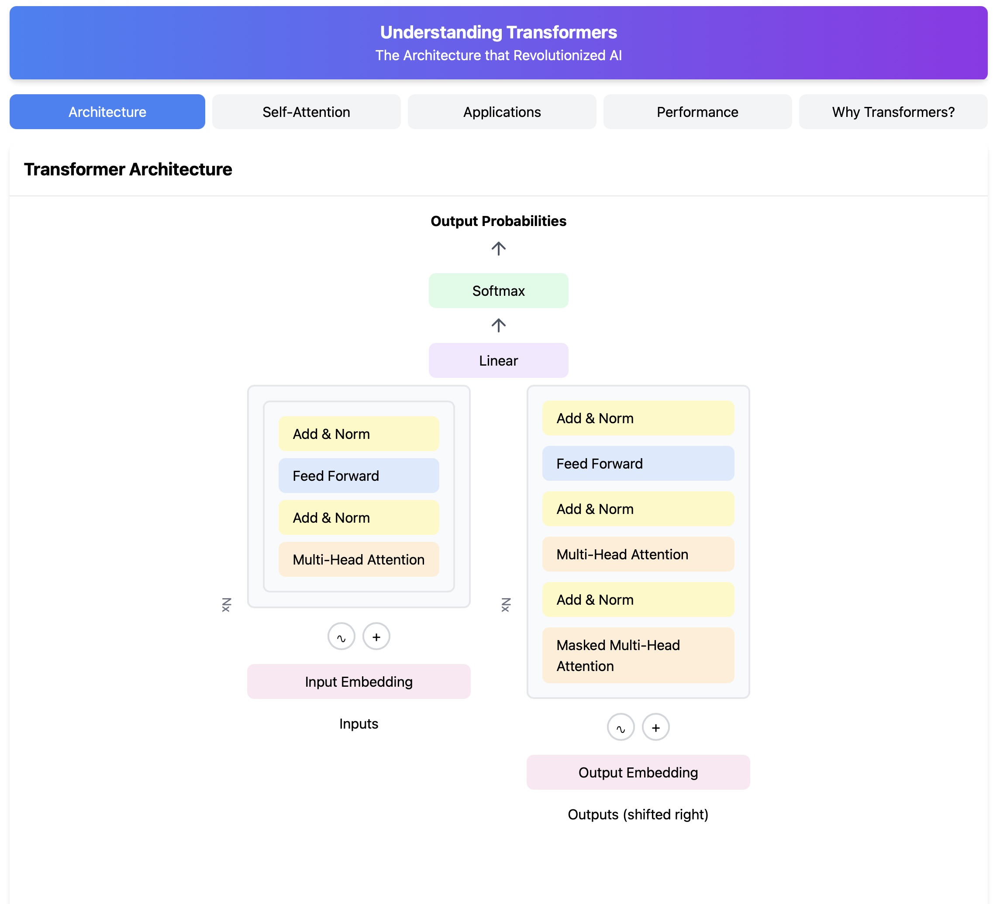
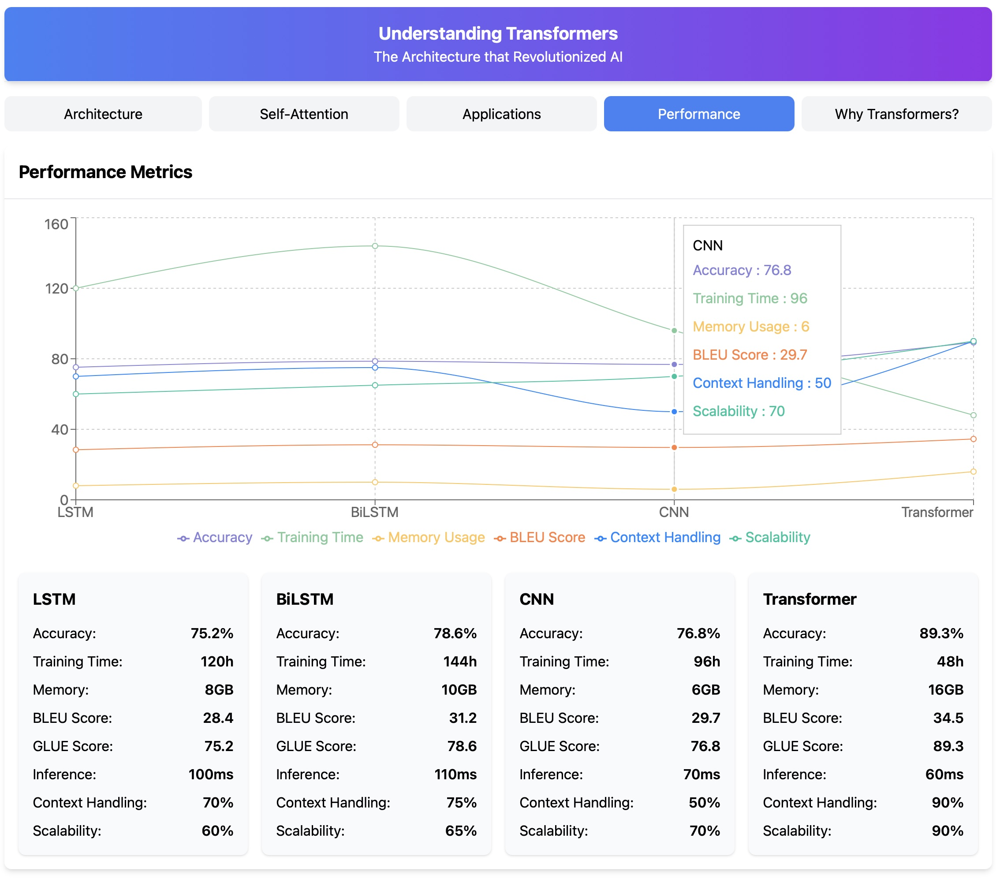

# Transformer Architecture Interactive Visualization

An interactive web application built with React to help understand the Transformer architecture, its evolution, and its impact on modern AI. This project provides visual explanations of key concepts in transformer models, including self-attention mechanisms, architectural comparisons, and performance metrics.

#### Transformer Architecture


## 🌟 Features

- **Interactive Timeline**: Visualize the evolution of transformer architecture
- **Architecture Visualization**: Animated diagram of encoder-decoder structure
- **Self-Attention Demo**: Live visualization of attention mechanisms
- **Performance Metrics**: Compare different transformer models
- **Comparative Analysis**: RNN vs LSTM vs Transformer architecture
- **Responsive Design**: Works seamlessly on desktop and mobile devices

#### Performance Metrics


## 🚀 Getting Started

### Prerequisites

- Node.js (v14 or higher)
- npm (v6 or higher)

### Installation

1. Clone the repository:
```bash
git clone https://github.com/ansh-info/Transformers-Explained.git
cd Transformers-Explained
```

2. Install dependencies:
```bash
npm install
```

3. Start the development server:
```bash
npm start
```

The application will be available at `http://localhost:3000`

## 📦 Project Structure

```
src/
  components/
    ui/
      card.js        # Basic card components
      tabs.js        # Tab navigation components
    sections/
      ArchitectureComparison.js  # Architecture comparison visualizations
      Timeline.js                # Historical timeline
      WhyTransformers.js         # Explanation of transformer benefits
    visualizations/
      ArchitectureAnimation.js   # Animated architecture diagram
      AttentionVisualizer.js     # Self-attention mechanism demo
      PerformanceChart.js        # Performance metrics charts
  App.js                         # Main application component
```

## 🛠️ Built With

- [React](https://reactjs.org/) - Frontend framework
- [Tailwind CSS](https://tailwindcss.com/) - Styling
- [Recharts](https://recharts.org/) - Data visualization
- [Lucide React](https://lucide.dev/) - Icons
- [Create React App](https://create-react-app.dev/) - Project setup

## 📚 Key Components

### Architecture Tab
- Displays the encoder-decoder structure
- Interactive visualization of transformer components
- Comparative analysis with other architectures

### Self-Attention Tab
- Live demonstration of attention mechanism
- Query, Key, Value explanation
- Interactive attention weights visualization

### Applications Tab
- Timeline of transformer development
- Real-world applications
- Use cases and examples

### Performance Tab
- Comparative metrics
- Performance charts
- Model comparisons

## 🎨 Customization

### Adding New Visualizations

1. Create a new component in `src/components/visualizations`
2. Import and add to the relevant tab in `App.js`
3. Add any necessary styles to Tailwind config

### Modifying Themes

Update the Tailwind configuration in `tailwind.config.js`:

```javascript
module.exports = {
  content: ["./src/**/*.{js,jsx,ts,tsx}"],
  theme: {
    extend: {
      // Add custom colors, spacing, etc.
    },
  },
  plugins: [],
}
```

## 🤝 Contributing

1. Fork the repository
2. Create your feature branch (`git checkout -b feature/AmazingFeature`)
3. Commit your changes (`git commit -m 'Add some AmazingFeature'`)
4. Push to the branch (`git push origin feature/AmazingFeature`)
5. Open a Pull Request

## 📝 License

This project is licensed under the MIT License - see the [LICENSE.md](LICENSE.md) file for details

## 🙏 Acknowledgments

- Inspired by the paper "Attention Is All You Need"
- Built upon the work of the transformer architecture creators
- Community contributions and feedback

## 🔮 Future Improvements

- [ ] Add more interactive animations
- [ ] Include code examples
- [ ] Add more architectural variants
- [ ] Implement interactive training visualization
- [ ] Add multilingual support

---